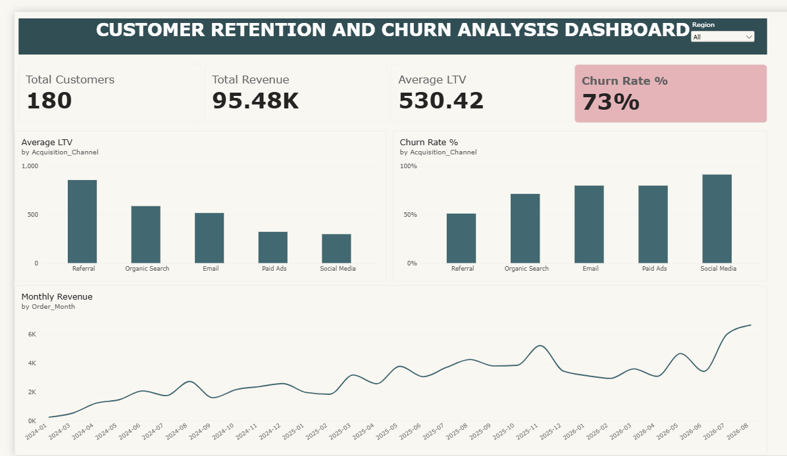
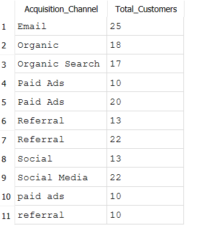
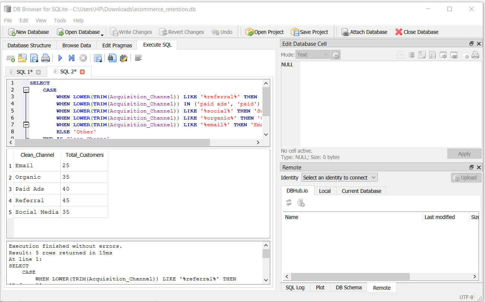
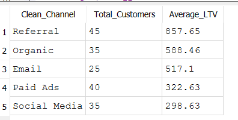
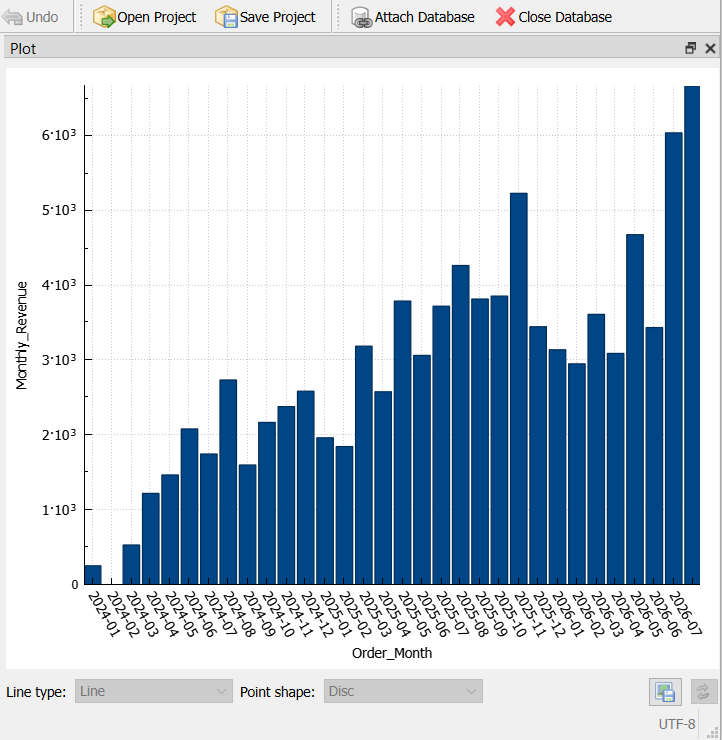

# Customer Retention & Churn Analysis (SQL + Power BI)

## Why this project
Across nearly every industry survey on 2026 business priorities, two themes dominate: margin pressure in an uncertain economy, and customer retention overtaking acquisition as the top growth lever — acquiring a new customer now costs roughly 5–7x more than keeping an existing one. This project applies SQL to the questions that pressure actually creates: which acquisition channels bring in customers who stick around, which customers have already gone quiet, and whether current discounting is helping retention or just eating margin.

## Dataset
A synthetic e-commerce dataset (180 customers, 607 orders) built to mirror the kind of two-table relational structure — customers and orders — found in almost any real transactional system, including realistic data quality issues:
- `customers`: `CustomerID`, `Signup_Date`, `Region`, `Acquisition_Channel`
- `orders`: `OrderID`, `CustomerID`, `Order_Date`, `Category`, `Order_Amount`, `Discount_Pct`

`Acquisition_Channel` ships with 11 raw label variants for 5 real channels (`"Paid Ads"`, `"paid ads"`, `"Paid Ads "` with a trailing space, etc.) and `Discount_Pct` has ~6% missing values — both discovered and handled as part of the analysis, not cleaned in advance.

## Questions Answered
1. **Repeat purchase rate** — how does it differ by acquisition channel?
2. **Churn** — which customers have had no order in 90+ days?
3. **Customer lifetime value** — how does it vary by channel and region?
4. **Discounting** — is it correlated with repeat purchases, or mostly cutting into margin?
5. **Revenue trend** — is it growing or shrinking month over month?

## Key Findings
- **Referral drives both frequency and value.** Referral customers average 5.49 orders each — more than double every other channel — and an average lifetime value of **$857.65**, nearly 3x Social Media's $298.63. This holds in every region individually, not just on average.
- **Email is a hidden churn risk.** Email looks strong on repeat rate (100%) and order frequency (3.24 avg), comparable to Organic — but has an 80% churn rate (no order in 90+ days), close to Paid Ads. It brings in customers who buy repeatedly *early*, then go quiet. That combination makes Email's churned customers a stronger win-back target than Social Media's, who barely engaged in the first place.
- **Heavy discounting doesn't buy loyalty.** Customers who receive modest average discounts (≤15%) order more (3.62 avg) and repeat more often (91.7%) than customers who receive steep discounts (>15%: 2.73 avg orders, 77.8% repeat). Discount depth is not a retention lever in this data.
- **Revenue grew steadily**, from ~$254 (Jan 2024) to ~$6,664/month (Aug 2026) — the most recent calendar month is intentionally excluded from that comparison, since it's a partial period.

## Power BI Dashboard
The same analysis as an interactive dashboard — 4 KPI cards, average LTV and churn rate by channel shown side by side (deliberately, so the Email finding below is visible without cross-referencing two tables), and the monthly revenue trend built on a proper date table so it doesn't misrepresent zero-order or partial months.

Built from the same `customers`/`orders` data (exported to CSV), with the `Acquisition_Channel` cleanup redone in Power Query and the repeat-purchase, churn, and LTV logic rebuilt as DAX measures — the same transformations as the SQL version, in the tool a stakeholder would actually open.

## Data Quality Process
Rather than assume the data was clean, every categorical and numeric column was profiled before use:
- `SELECT COUNT(DISTINCT col)` to flag columns with a suspiciously high number of categories
- `COUNT(*) - COUNT(col)` across every column in one query, to find nulls
- `GROUP BY` on any suspect column to see actual variants and frequencies
- Range checks (`MIN`/`MAX`) on numeric columns before assuming their scale (this caught a bug where a discount threshold was written for a 0–1 scale against data stored as 0–100)

## Tools
SQLite (`ecommerce_retention.db`), queried and verified in DB Browser for SQLite. The same query results were exported to CSV and rebuilt as an interactive Power BI dashboard, with the data cleaning and business logic reproduced in Power Query and DAX.

## Files
- `sql/01_schema.sql` — table definitions
- `sql/02_data_profiling.sql` — the checks that surfaced the messy channel labels and missing discounts
- `sql/03_q1_repeat_purchase_rate.sql`
- `sql/04_q2_churn_analysis.sql`
- `sql/05_q3_customer_lifetime_value.sql`
- `sql/06_q4_discount_impact.sql`
- `sql/07_q5_monthly_revenue_trend.sql`
- `dashboard/dashboard_overview.png` — the Power BI dashboard

## Screenshots

**The messy data, unfixed** — `Acquisition_Channel` grouped with no cleanup: 11 raw variants for what should be 5 channels.

**Cleaned in the query itself** — `LOWER(TRIM(...))` + `LIKE` pattern matching collapses those 11 variants down to the 5 real channels.

**The headline finding** — average customer lifetime value by channel: Referral customers ($857.65) are worth nearly 3x a Social Media customer ($298.63).

**Revenue trend, month over month** — steady growth from ~$254 (Jan 2024) to ~$6,664/month (Aug 2026), plotted directly from the gap-filled query.

